# Red para una universidad

## 1ra Seccion

En esta sección encontramos una conexión de subred de clase B ósea es una red para estudiantes con acceso a internet. que esta conectado con la red local (LAN) a través de un switch y permite que los estudiantes accedan a internet y que tengan recursos compartidos.

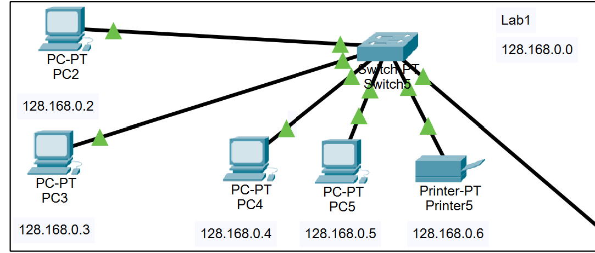

## 2da Seccion

De igual forma en esta sección es otro laboratorio pero con una clase de subred diferente que seria la clase C que es una red privada para técnicos y personal de soporte. Y de igual forma esta conectado  a (LAN).

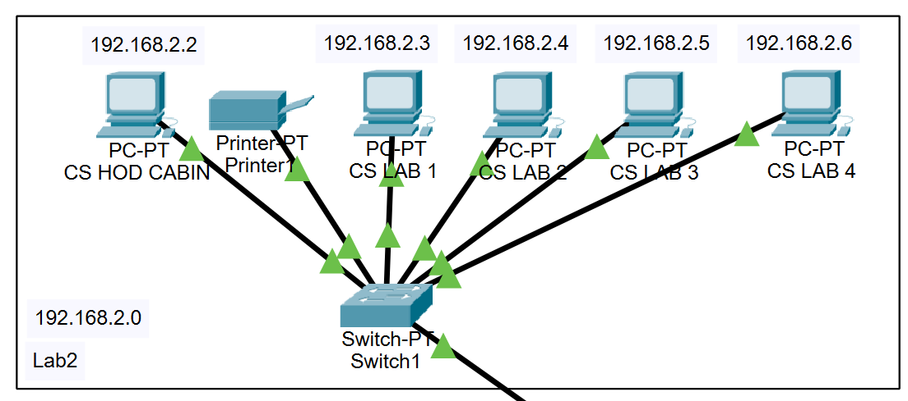

## 3ra Seccion

Aquí se ven dos tipos de conexiones de clase C que en si es el departamento central de la institución que es donde esta conectado los Access point que permite que los estudiantes tengan conexiones inalámbricas a sus estudiantes en toda la institución ya sean teléfonos, tablets, laptops.

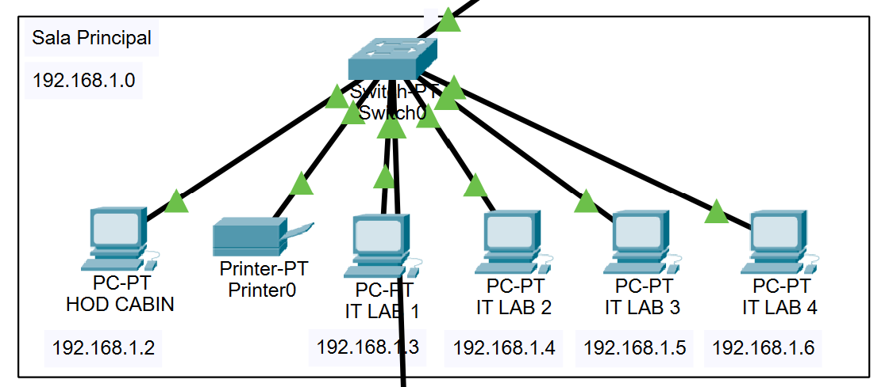
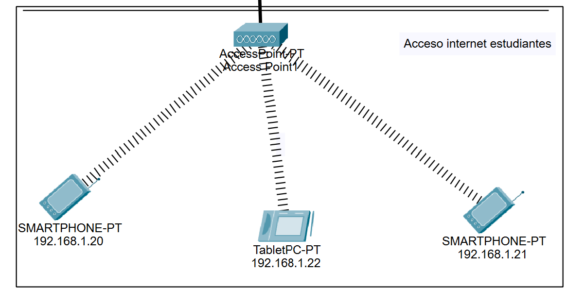

## 4ta Seccion

Esta conexión de igual forma es de clase C pero es de la sala de admisiones que es una red exclusiva para los trabajadores de esa área para que puedan hacer inscripciones mas rápidas o trabajos mas rapidos.

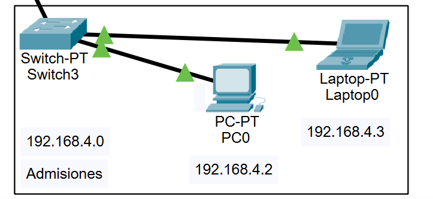

## 5ta Seccion

Esta es la sala de servidores que cuenta con una conexión tipo A que es una red publica ya que si quisiéramos que fuera privada lo pondríamos  1.1.0.0 entonces lo mantenemos en publica por la conexión entre dispositivos el servidor FTP que almacena archivos compartidos, el servidor DNS que permite que los dispositivos usen nombres de dominio en lugar de direcciones ip y por ultimo WEB que es para alojar la pagina web de la institución y accedan a su información.

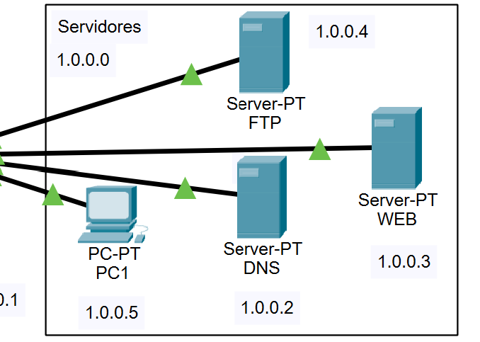

## 6ta Seccion

Estas son las conexiones entre routers que son de tipo A que estas conexiones
Sin son de red privada. Y el router 2 hace conexión con los servidores para que
Este conectado al resto de la red.

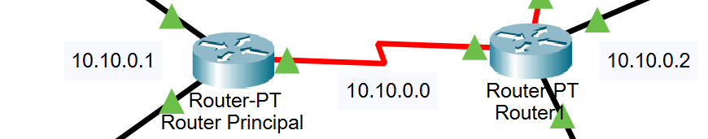
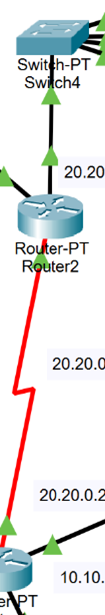

# Pruebas

## 1ra Prueba

Este ping es desde el telefono de conexion inalambrica al switch que se puede ver que tiene conexion a internet sin ningun paquete perdido

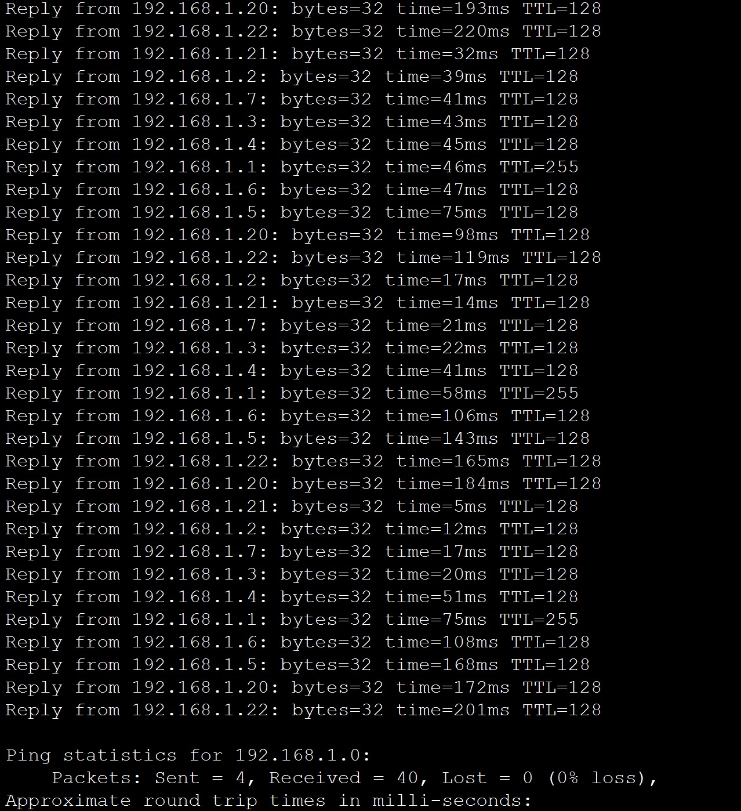

## 2da Prueba

De igual forma este es de un celular y hace ping con un servidor sin ningun tipo de problemas

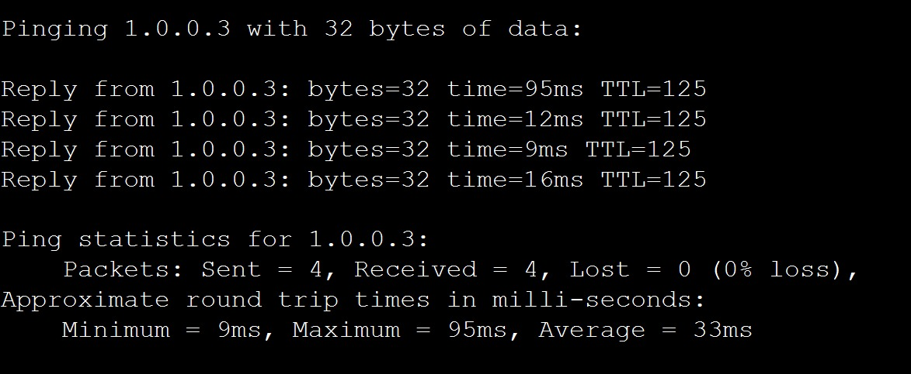

## 3ra Prueba

Aqui se ve las conexiones entre computadoras desde la sala principal al Lab2 que se hacen conexion entre ellos

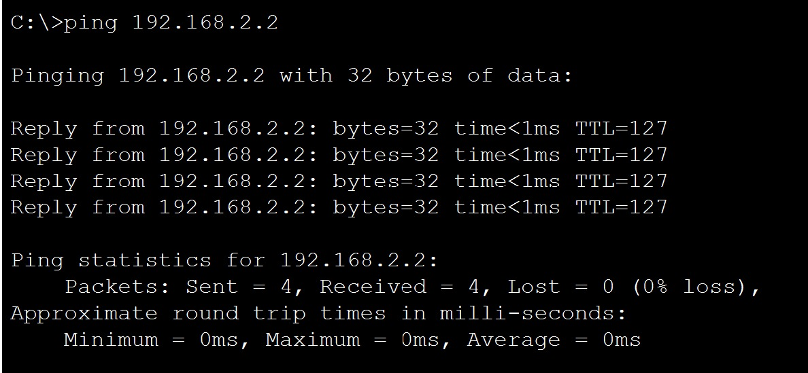
